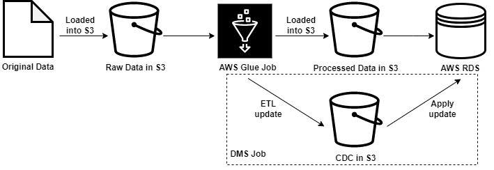

## Introduction
Welcome to Aspen Capital's Data Engineering challenge. This assignment will help us assess your technical skills. We recommend that you focus on the core requirements listed below and if time permitting - work on any additional features of your own choosing. We are using AWS so that is the preferred cloud provider for this project, but if you aren't familiar with AWS, feel free to use an alternate cloud provider you are familiar with. This project is a starting place - if something doesn't make sense or you know a better way go with that. Document the tradeoffs you made in going with alternatives. This is project is understanding how you engineer systems - the goal is to understand how you think, not to get a particular solution.

## Background
We are in the process of migrating legacy databases to AWS. The legacy databases are located on prem in a colocation facility. We need to migrate the data in a cost effective way and be able to operate it with a small ops team. We need a pipeline that will sync the data to an AWS data lake and then ETL it into a datastore (e.g RDS, Athena, etc.) to provide the data source for the new applications being built. While the migration is happening the AWS and on prem data need to stay in sync (some delay is allowed. Part of the submission is to decide what delay makes sense).

## Repo Structure
- The script for AWS Glue job is included under etl/glue_etl.py
- The json script of database schema is needed for AWS DMS using S3 as data source. It is included in etl/schema.json
- The design document is included as the design_doc.pdf. Discussions on the technical details, alternatives and trade-offs can be found here.
- IaC for deploying Glue job and RDS is complex and not saving much time from creating through AWS console and due to limited, it is not included 

## Architure


- First, we load the raw data .xlsx file into an existing S3 bucket.
- Than we set up the Glue ETL job, with corresponding crawler and role policies and execute the job. Alternatively, we can interactively run the job through Glue notebook. Create a new notebook and paste the glue_etl.py, finally let it run about 5 min. It will save the processed data into another S3 bucket.
- Now, we create an RDS Mysql database, and associate it with an EC2 instance as client. After initialization, we first install Mysql community edition on EC2 client through ```yum install mysql```, then we sync the processed data from S3 to EC2 local file system. Finally execute the create_table.sql and load_data.sh.
- Here, we have the data migrated. Next, we will deploy the data updates synchronization using AWS DMS. 


## Credentials
It is extremely dangerous to include the credentials in a public/private repo. So, I did not include it here.
